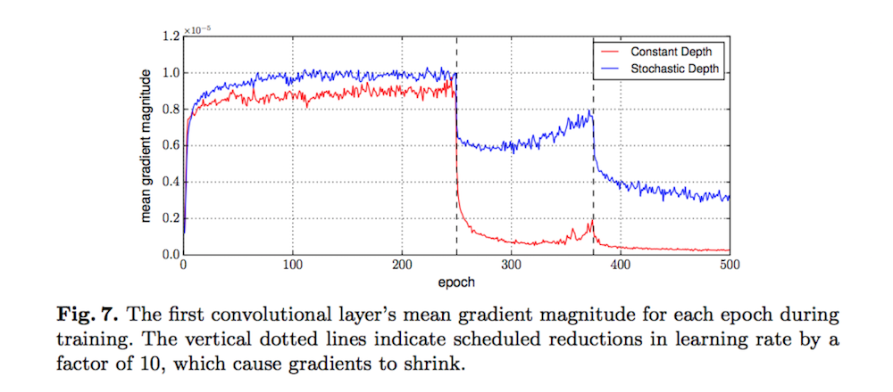
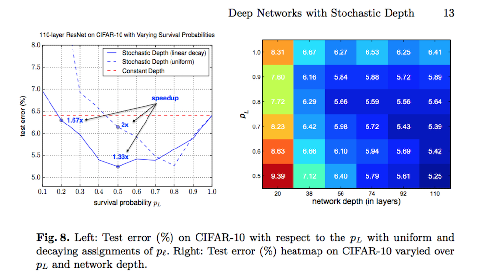

# Deep Networks with Stochastic Depth

- Submitted on 2016. 3
- Gao Huang, Yu Sun, Zhuang Liu, Daniel Sedra and Kilian Weinberger

## Simple Summary

> propose stochastic depth, a training procedure that enables the seemingly contradictory setup to train short networks and use deep networks at test time. We start with very deep networks but during training, for each mini-batch, randomly drop a subset of layers and bypass them with the identity function.

- Address these problems: the gradients can vanish, the forward flow often diminishes, and the training time can be painfully slow.

 
 
 - Randomly dropping entire ResBlocks during training and bypassing their transformations through skip connections.
 - The linearly decaying **survival probability** originates from our intuition that the earlier layers extract low-level features that will be used by later layers and should therefore be more reliably present.

 
 
- mean gradient magnitudes and epoch cause vanising gradients. 

 
 
- Hyper-parameter sensitivity

- Can be interpreted as an **ensemble** of networks with varying depth
- Training with stochastic depth allows one to increase the depth of a network well beyond 1000 layers, and still obtain a reduction in test error.