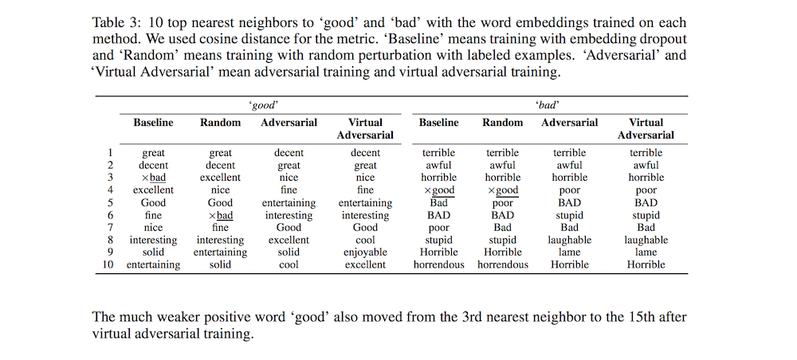

# Adversarial Training Methods for Semi-Supervised Text Classification

- Submitted on 2016. 5
- Takeru Miyato, Andrew M. Dai and Ian Goodfellow

## Simple Summary

> Extend adversarial and virtual adversarial training to the text domain by applying perturbations to the word embeddings in a recurrent neural network rather than to the original input itself. The proposed method achieves state of the art results on multiple benchmark semi-supervised and purely supervised tasks. We provide visualizations and analysis showing that the learned word embeddings have improved in quality and that while training, the model is less prone to overfitting.

- **Adversarial training** is the process of training a model to correctly classify both unmodified examples and adversarial examples. It improves not only robustness to adversarial examples, but also generalization performance for original examples.
- **Virtual adversarial training** extends the idea of adversarial training to the semi-supervised regime and unlabeled examples. This is done by regularizing the model so that given an example, the model will produce the same output distribution as it produces on an adversarial perturbation of that example. 

- Replace the embeddings v_k with normalized embeddings v¯k
	- The model could trivially learn to make the perturbations insignificant.
- Adversarial training: adversarial training adds the following term to the cost function

- Virtual adversarial training: adds the following term to the cost function

- Adversarial and virtual adversarial training improved not only classification performance but also the quality of word embeddings.
- Good regularization performance in sequence models on text classification tasks.
	