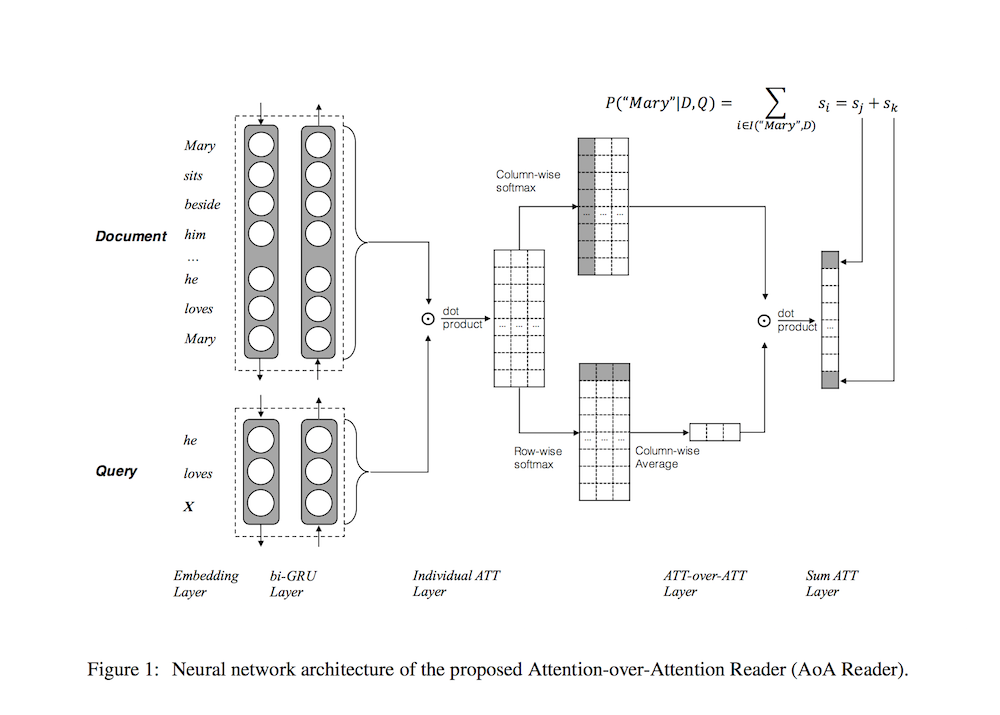
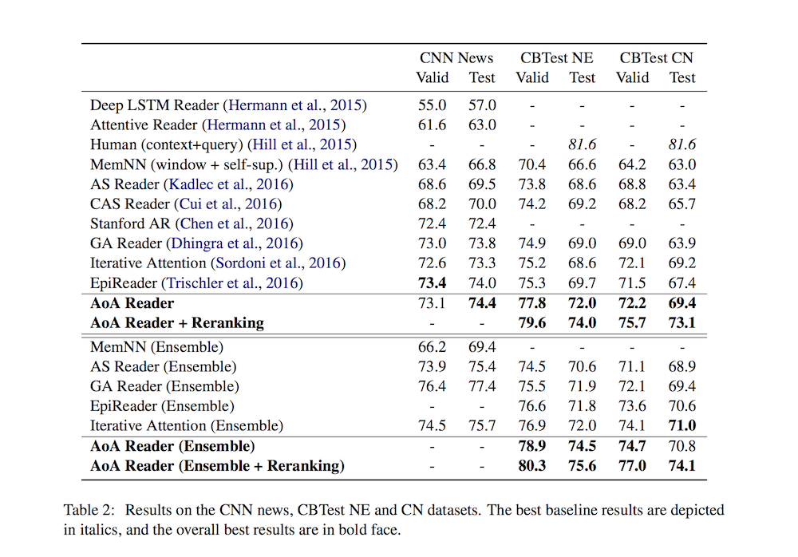

# Attention-over-Attention Neural Networks for Reading Comprehension

- Submitted on 2016. 7
- Yiming Cui, Zhipeng Chen, Si Wei, Shijin Wang, Ting Liu and Guoping Hu

## Simple Summary

> attention-over-attention reader for the Cloze-style reading comprehension task. Our model aims to place another attention mechanism over the document-level attention, and induces "attended attention" for final predictions. our neural network model requires less pre-defined hyper-parameters and uses an elegant architecture for modeling. 

- Cloze-style reading comprehension problem
- Datasets
	1. [CNN / Daily Mail](http://cs.nyu.edu/~kcho/DMQA/)
	2. [Children’s Book Test](http://www.thespermwhale.com/jaseweston/babi/CBTest.tgz)

- Attention-over-Attention Reader
	1. Contextual Embedding
	2. Pair-wise Matching Score
	3. Individual Attentions
	4. Attention-over-Attention
	5. Final Predictions

- N-best Re-ranking Strategy
	1. N-best Decoding
	2. Refill Candidate into Query
	3. Feature Scoring
	4. Weight Tuning
	5. Re-scoring and Re-ranking

- The proposed AoA Reader aims to compute the attentions not only for the document but also the query side, which will benefit from the mutual information. Then a weighted sum of attention is carried out to get an attended attention over the document for the final predictions.