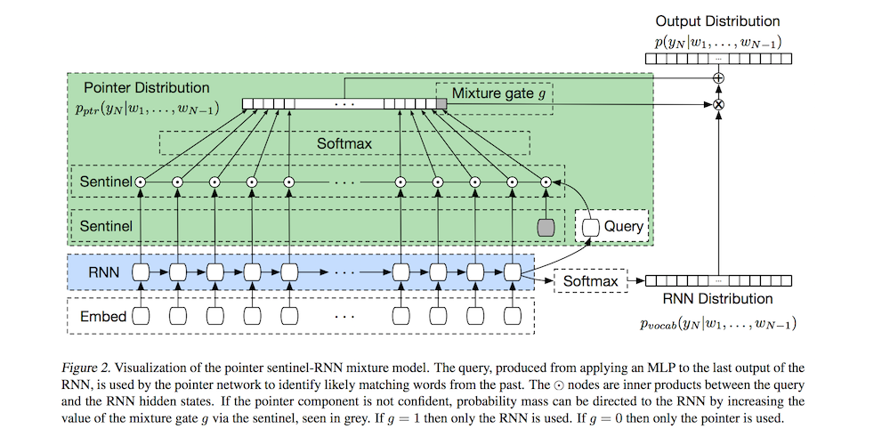

# Pointer Sentinel Mixture Models

- Submitted on 2016. 9
- Stephen Merity, Caiming Xiong, James Bradbury and Richard Socher

## Simple Summary

>  the pointer sentinel mixture architecture for neural sequence models which has the ability to either reproduce a word from the recent context or produce a word from a standard softmax classifier. Our pointer sentinel-LSTM model achieves state of the art language modeling performance on the Penn Treebank (70.9 perplexity) while using far fewer parameters than a standard softmax LSTM.

- `p(y_i|x_i) = g p_vocab(y_i|x_i) + (1 − g) p_ptr(y_i|x_i)`
- the new pointer sentinel gate `g` = a[V + 1]. (attention distribution over both the words ) 
- Any probability mass assigned to g is given to the standard
softmax vocabulary of the RNN. The final updated, normalized pointer probability over the vocabulary in the window then becomes:
	- `p_ptr(y_i|x_i) = 1 / 1−g * a[1:V]`
- WikiText-2 and WikiText-103
	- this new dataset can serve as a platform to improve handling of rare words and the usage of long term dependencies in language modeling.
- PS-LSTM model improvements for rare words.