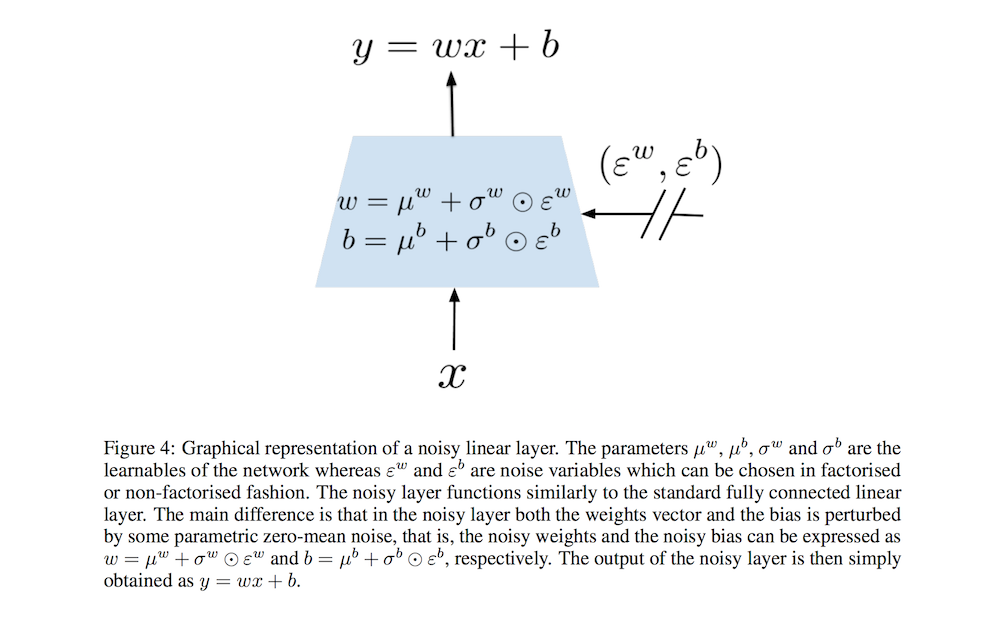

# Noisy Networks for Exploration

- Submitted on 2017. 6
- Meire Fortunato, Mohammad Gheshlaghi Azar, Bilal Piot, Jacob Menick, Ian Osband, Alex Graves, Vlad Mnih, Remi Munos, Demis Hassabis, Olivier Pietquin, Charles Blundell, Shane Legg

## Simple Summary

> Introduce NoisyNet, a deep reinforcement learning agent with parametric noise added to its weights, and show that the induced stochasticity of the agent's policy can be used to aid efficient exploration. The parameters of the noise are learned with gradient descent along with the remaining network weights. NoisyNet is straightforward to implement and adds little computational overhead. We find that replacing the conventional exploration heuristics for A3C, DQN and dueling agents (entropy reward and ϵ-greedy respectively) with NoisyNet yields substantially higher scores for a wide range of Atari games.

- Optimism in the face of uncertainty is a common exploration heuristic in reinforcement learning.
- a single change to the weight vector can induce a consistent, and potentially very complex, state-dependent change in policy over multiple time steps.
- The variance of the perturbation is a parameter that can be considered as
the energy of the injected noise. These variance parameters are learned using gradients from the reinforcement learning loss function, along side the other parameters of the agent.

- NoisyNet
	-  a randomised value function, where the functional form is a neural
network. (whose weights and biases are perturbed by a parametric function
of the noise)
	- these algorithms are quite generic and apply to any type of parametric policies (including neural networks), they are usually not data efficient and require a simulator to allow many policy evaluations.

1. Independent Gaussian noise: 
	- the noise applied to each weight and bias is independent ( for each noisy linear layer, there are pq + q noise variables (for p inputs to the layer and q outputs))
2. Factorised Gaussian noise: 
	- two vectors - the first has length of input, the second has length of the output, then we apply special function to both vections and calculate matrix multiplication of them. The result is then used as a random matrix which added to the weights.

- Experiments
	- Deep Q-Networks (DQN) and Dueling.
	- Asynchronous Advantage Actor Critic (A3C).

	

