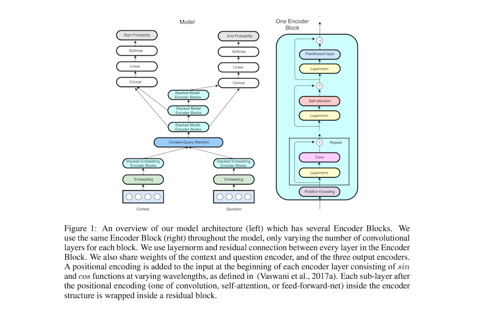
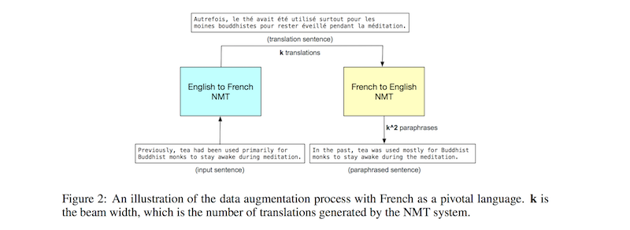

# QANet: Combining Local Convolution with Global Self-Attention for Reading Comprehension

- Submitted on 2018. 2
- Adams Wei Yu, David Dohan, Minh-Thang Luong, Rui Zhao, Kai Chen, Mohammad Norouzi, Quoc V. Le

## Simple Summary

> Propose a new Q\&A model that does not require recurrent networks:  It consists exclusively of attention and convolutions, yet achieves equivalent or better performance than existing models. On the SQuAD dataset, our model is 3x to 13x faster in training and 4x to 9x faster in inference. The speed-up gain allows us to train the model with much more data. We hence  combine our model with data generated by backtranslation from a neural machine translation model. This data augmentation technique  not only enhances the training examples but also diversifies the phrasing of the sentences, which results in immediate accuracy improvements.

- Aiming to make the machine comprehension fast, we propose to remove the recurrent nature of these models. (bottleneck)

- Model design:
	- Convolution captures the localstructure of the text
	- Self-attention learns the global interaction between each pair of words.

	
- Data augmentation:
	- use two translation models (Eng -> Fre, Fre -> Eng)

- Achieving up to 13x speedup in training and 9x per training iteration, compared to the RNN counterparts.
- Single model, trained with augmented data, achieves 84.6 F1 score on the test set